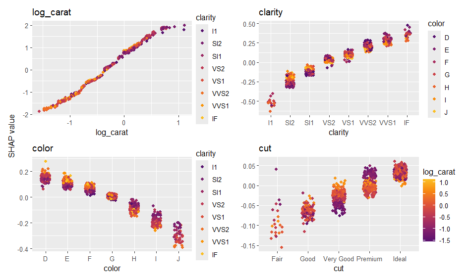
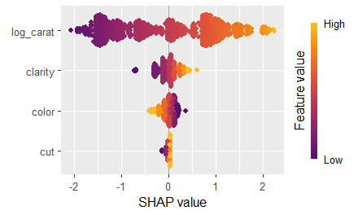
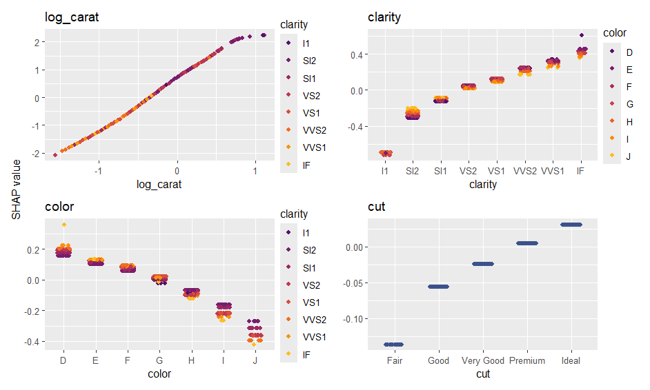
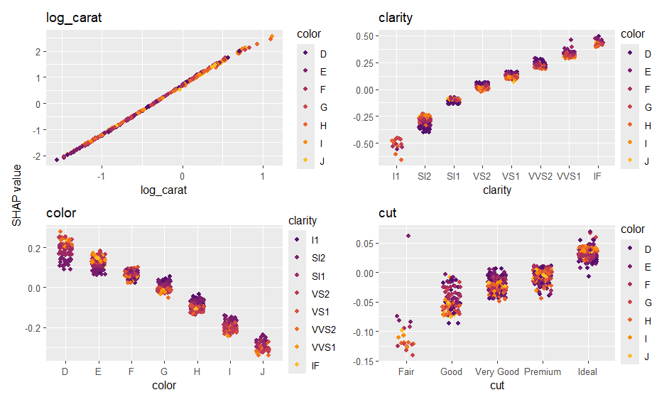
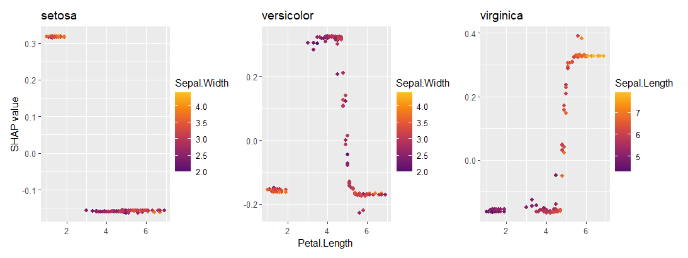

# kernelshap <a href='https://github.com/ModelOriented/kernelshap'></a>

<!-- badges: start -->

[](https://github.com/ModelOriented/kernelshap/actions/workflows/R-CMD-check.yaml)
[](https://app.codecov.io/gh/ModelOriented/kernelshap)
[](https://cran.r-project.org/package=kernelshap)

[](https://cran.r-project.org/package=kernelshap) 
[](https://cran.r-project.org/package=kernelshap)

<!-- badges: end -->

## Overview

The package contains three functions to crunch SHAP values:

- **`permshap()`**: Permutation SHAP algorithm of [1]. Both exact and sampling versions are available.
- **`kernelshap()`**: Kernel SHAP algorithm of [2] and [3]. Both exact and (partly exact) sampling versions are available.
- **`additive_shap()`**: For *additive models* fitted via `lm()`, `glm()`, `mgcv::gam()`, `mgcv::bam()`, `gam::gam()`, `survival::coxph()`, or `survival::survreg()`. Exponentially faster than the model-agnostic options above, and recommended if possible.

To explain your model, select an explanation dataset `X` (up to 1000 rows from the training data, feature columns only). Use {shapviz} to visualize the resulting SHAP values. 

**Remarks to `permshap()` and `kernelshap()`**

- Both algorithms need a representative background data `bg_X` to calculate marginal means (up to 500 rows from the training data). In cases with a natural "off" value (like MNIST digits), this can also be a single row with all values set to the off value. If unspecified, 200 rows are randomly sampled from `X`.
- Exact Kernel SHAP gives identical results as exact permutation SHAP. The algorithms are fast for up to 8 features.
  With more features, `kernelshap()` switches to a partly exact algorithm with faster convergence than the sampling version of permutation SHAP.
- For models with interactions of order up to two, the sampling versions provide the same results as the exact versions.
- Sampling versions iterate until standard errors of SHAP values are sufficiently small.
- For additive models, `permshap()` and `kernelshap()` give the same results as `additive_shap` 
as long as the full training data would be used as background data.

## Installation

```r
# From CRAN
install.packages("kernelshap")

# Or the development version:
devtools::install_github("ModelOriented/kernelshap")
```

## Basic Usage

Let's model diamond prices with a random forest. As an alternative, you could use the {treeshap} package in this situation.

```r
library(kernelshap)
library(ggplot2)
library(ranger)
library(shapviz)

progressr::handlers(global = TRUE)  # activates progress bar

options(ranger.num.threads = 8)

diamonds <- transform(
  diamonds,
  log_price = log(price),
  log_carat = log(carat)
)

xvars <- c("log_carat", "clarity", "color", "cut")

fit <- ranger(
  log_price ~ log_carat + clarity + color + cut, 
  data = diamonds, 
  num.trees = 100,
  seed = 20
)
fit  # OOB R-squared 0.989

# 1) Sample rows to be explained
set.seed(10)
X <- diamonds[sample(nrow(diamonds), 1000), xvars]

# 2) Optional: Select background data. If unspecified, 200 rows from X are used
bg_X <- diamonds[sample(nrow(diamonds), 200), ]

# 3) Crunch SHAP values (22 seconds)
# Since the number of features is small, we use permshap()
system.time(
  ps <- permshap(fit, X, bg_X = bg_X)
)
ps

# SHAP values of first observations:
      log_carat     clarity       color         cut
[1,]  1.1913247  0.09005467 -0.13430720 0.000682593
[2,] -0.4931989 -0.11724773  0.09868921 0.028563613

# Indeed, Kernel SHAP gives the same:
ks <- kernelshap(fit, X, bg_X = bg_X)
ks
      log_carat     clarity       color         cut
[1,]  1.1913247  0.09005467 -0.13430720 0.000682593
[2,] -0.4931989 -0.11724773  0.09868921 0.028563613

# 4) Analyze with {shapviz}
ps <- shapviz(ps)
sv_importance(ps)
sv_dependence(ps, xvars)
```




## More Examples

The {kernelshap} package can deal with almost any situation. We will show some of the flexibility here. The first two examples require you to run at least up to Step 2 of the "Basic Usage" code.

### Parallel computing

Parallel computing for `permshap()` and `kernelshap()` is supported via {future.apply}.

```r
library(mgcv)

future::plan(multisession, workers = 4)  # Windows
# future::plan(multicore, workers = 4)   # Linux, macOS, Solaris

# GAM with interactions - we cannot use additive_shap()
fit <- gam(log_price ~ s(log_carat) + clarity * color + cut, data = diamonds)

system.time(  # 4 seconds in parallel
  ps <- permshap(fit, X, bg_X = bg_X)
)
ps

# SHAP values of first observations:
#      log_carat    clarity       color         cut
# [1,]   1.26801  0.1023518 -0.09223291 0.004512402
# [2,]  -0.51546 -0.1174766  0.11122775 0.030243973

# Because there are no interactions of order above 2, Kernel SHAP gives the same:
future::plan("sequential") 
system.time(  # 12 s non-parallel
  ks <- kernelshap(fit, X, bg_X = bg_X)
)
all.equal(ps$S, ks$S)
# [1] TRUE

# Now the usual plots:
sv <- shapviz(ps)
sv_importance(sv, kind = "bee")
sv_dependence(sv, xvars)
```





### Taylored predict()

In this {keras} example, we show how to use a tailored `predict()` function that complies with 

- the Keras API, 
- uses sufficiently large batches, and 
- turns off the Keras progress bar.

(The results are not fully reproducible.)

```r
library(keras)

nn <- keras_model_sequential()
nn |>
  layer_dense(units = 30, activation = "relu", input_shape = 4) |>
  layer_dense(units = 15, activation = "relu") |>
  layer_dense(units = 1)

nn |>
  compile(optimizer = optimizer_adam(0.001), loss = "mse")

cb <- list(
  callback_early_stopping(patience = 20),
  callback_reduce_lr_on_plateau(patience = 5)
)
       
nn |>
  fit(
    x = data.matrix(diamonds[xvars]),
    y = diamonds$log_price,
    epochs = 100,
    batch_size = 400, 
    validation_split = 0.2,
    callbacks = cb
  )

pred_fun <- function(mod, X) 
  predict(mod, data.matrix(X), batch_size = 1e4, verbose = FALSE, workers = 4)

system.time(  # 42 s
  ps <- permshap(nn, X, bg_X = bg_X, pred_fun = pred_fun)
)

ps <- shapviz(ps)
sv_importance(ps, show_numbers = TRUE)
sv_dependence(ps, xvars)
```




### Additive SHAP

The additive explainer extracts the additive contribution of each feature from a model of suitable class.

```r
fit <- lm(log(price) ~ log(carat) + color + clarity + cut, data = diamonds)
shap_values <- additive_shap(fit, diamonds) |> 
  shapviz()
sv_importance(shap_values)
sv_dependence(shap_values, v = "carat", color_var = NULL)
```

### Multi-output models

{kernelshap} supports multivariate predictions like:

- probabilistic classification,
- regression with multivariate response, and
- predictions found by applying multiple regression models.

Here, we use the `iris` data (no need to run code from above).

```r
library(kernelshap)
library(ranger)
library(shapviz)

set.seed(1)

# Probabilistic classification
fit_prob <- ranger(Species ~ ., data = iris, probability = TRUE)
ps_prob <- permshap(fit_prob, X = iris[-5]) |> 
  shapviz()
sv_importance(ps_prob)
sv_dependence(ps_prob, "Petal.Length")
```




### Meta-learners

Meta-learning packages like {tidymodels}, {caret} or {mlr3} are straightforward to use. The following examples additionally shows that the `...` arguments of `permshap()` and `kernelshap()` are passed to `predict()`.

#### Tidymodels

```r
library(kernelshap)
library(tidymodels)

set.seed(1)

iris_recipe <- iris |> 
  recipe(Species ~ .)

mod <- rand_forest(trees = 100) |>
  set_engine("ranger") |> 
  set_mode("classification")
  
iris_wf <- workflow() |>
  add_recipe(iris_recipe) |>
  add_model(mod)

fit <- iris_wf |>
  fit(iris)

system.time(  # 3s
  ps <- permshap(fit, iris[-5], type = "prob")
)
ps

# Some values
$.pred_setosa
     Sepal.Length Sepal.Width Petal.Length Petal.Width
[1,]   0.02186111 0.012137778    0.3658278   0.2667667
[2,]   0.02628333 0.001315556    0.3683833   0.2706111
```

#### caret

```r
library(kernelshap)
library(caret)

fit <- train(
  Sepal.Length ~ ., 
  data = iris, 
  method = "lm", 
  tuneGrid = data.frame(intercept = TRUE),
  trControl = trainControl(method = "none")
)

ps <- permshap(fit, iris[-1])
```

#### mlr3

```r
library(kernelshap)
library(mlr3)
library(mlr3learners)

set.seed(1)

task_classif <- TaskClassif$new(id = "1", backend = iris, target = "Species")
learner_classif <- lrn("classif.rpart", predict_type = "prob")
learner_classif$train(task_classif)

x <- learner_classif$selected_features()

# Don't forget to pass predict_type = "prob" to mlr3's predict()
ps <- permshap(
  learner_classif, X = iris, feature_names = x, predict_type = "prob"
)
ps
# $setosa
#      Petal.Length Petal.Width
# [1,]    0.6666667           0
# [2,]    0.6666667           0
```

## References

[1] Erik Štrumbelj and Igor Kononenko. Explaining prediction models and individual predictions with feature contributions. Knowledge and Information Systems 41, 2014.

[2] Scott M. Lundberg and Su-In Lee. A Unified Approach to Interpreting Model Predictions. Advances in Neural Information Processing Systems 30, 2017.

[3] Ian Covert and Su-In Lee. Improving KernelSHAP: Practical Shapley Value Estimation Using Linear Regression. Proceedings of The 24th International Conference on Artificial Intelligence and Statistics, PMLR 130:3457-3465, 2021.
