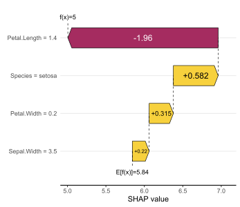
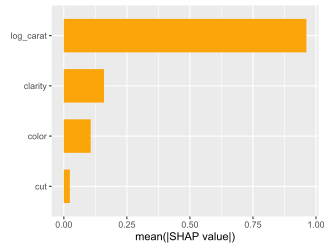
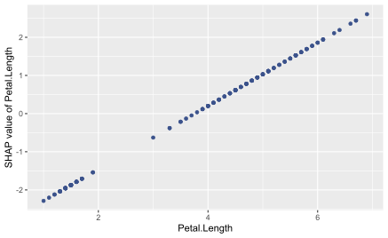
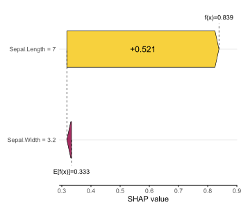
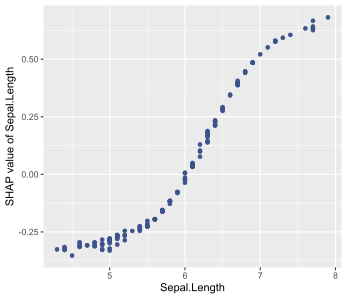
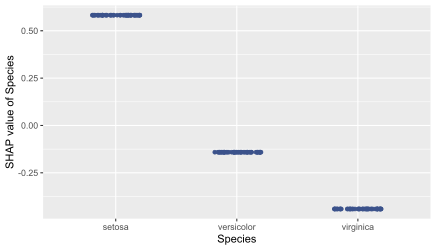
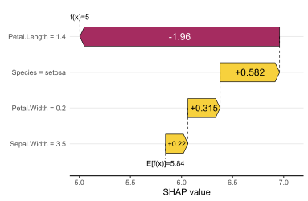
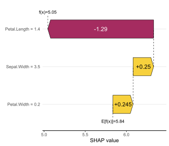
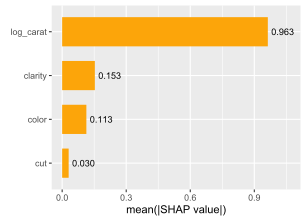
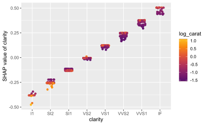

# The "kernelshap" package <a href='https://github.com/mayer79/kernelshap'></a>

## Introduction

SHAP values (Lundberg and Lee, 2017) decompose model predictions into additive contributions of the features in a fair way. A model agnostic approach is called Kernel SHAP, introduced in Lundberg and Lee (2017), and investigated in detail in Covert and Lee (2021). 

The "kernelshap" package implements a multidimensional refinement of the Kernel SHAP Algorithm described in Covert and Lee (2021). The package allows to calculate Kernel SHAP values in an exact way, by iterative sampling (as in Covert and Lee, 2021), or a hybrid of the two. As soon as sampling is involved, the algorithm iterates until convergence, and standard errors are provided.

The default behaviour depends on the number of features $p$:

- $2 \le p \le 8$: Exact Kernel SHAP values are returned. (Exact regarding the given background data.)
- $p > 8$: Hybrid (partly exact) iterative version of Kernel SHAP. The algorithm iterates until Kernel SHAP values are sufficiently accurate.
- $p = 1$: Exact Shapley values are returned.

The main function `kernelshap()` has four key arguments:

- `object`: Fitted model object.
- `X`: A (n x p) `matrix`, `data.frame`, `tibble` or `data.table` of rows to be explained. Important: The columns should only represent model features, not the response.
- `bg_X`: Background data used to integrate out "switched off" features, 
often a subset of the training data (around 100 to 500 rows).
It should contain the same columns as `X`.
Columns not in `X` are silently dropped and the columns are arranged into
the order as they appear in `X`.
- `pred_fun`: Prediction function of the form `function(object, X, ...)`,
providing K >= 1 numeric predictions per row. Its first argument represents the
model `object`, its second argument a data structure like `X`.
(The names of the first two arguments do not matter.) Additional (named)
arguments are passed via `...` of `kernelshap()`. The default, `stats::predict`, will
work in most cases. Some exceptions (classes "ranger" and mlr3 "Learner")
are handled separately. In other cases, the function must be specified manually.

Additional arguments of `kernelshap()` can be used to control details of the algorithm and to activate parallel processing.

**Remarks**

- To visualize the result, you can use R package "shapviz".
- Passing `bg_w` allows to weight background data according to case weights.
- The algorithm tends to run faster if `X` is a matrix or tibble.
- In order to use parallel processing, the backend must be set up beforehand.

## Installation

``` r
# install.packages("devtools")
devtools::install_github("mayer79/kernelshap")
```

## Examples

### Linear regression

```r
library(kernelshap)
library(shapviz)

fit <- lm(Sepal.Length ~ ., data = iris)

# Crunch SHAP values
s <- kernelshap(fit, iris[-1], bg_X = iris)
s

# SHAP values of first 2 observations:
#      Sepal.Width Petal.Length Petal.Width   Species
# [1,]  0.21951350    -1.955357   0.3149451 0.5823533
# [2,] -0.02843097    -1.955357   0.3149451 0.5823533

# Plot with shapviz
shp <- shapviz(s)
sv_waterfall(shp, 1)
sv_importance(shp)
sv_dependence(shp, "Petal.Length")
```







### Logistic regression on probability scale

```r
library(kernelshap)
library(shapviz)

fit <- glm(
  I(Species == "virginica") ~ Sepal.Length + Sepal.Width, data = iris, family = binomial
)

# Crunch SHAP values
s <- kernelshap(fit, iris[1:2], bg_X = iris, type = "response")

# Plot with shapviz
shp <- shapviz(s)
sv_waterfall(shp, 51)
sv_dependence(shp, "Sepal.Length")
```




### Probability random forest (multivariate predictions)

```r
library(ranger)
library(kernelshap)

set.seed(1)
fit <- ranger(Species ~ ., data = iris, probability = TRUE)

s <- kernelshap(fit, iris[c(1, 51, 101), -5], bg_X = iris)
summary(s)

# Exact Kernel SHAP values
#   - 3 SHAP matrices of dim 3 x 4
#   - baseline: 0.3332606 0.3347014 0.332038
#   - m_exact: 14
# 
# SHAP values of first 2 observations:
# [[1]]
#      Sepal.Length  Sepal.Width Petal.Length Petal.Width
# [1,]   0.02299032  0.008345772    0.3168792   0.3185242
# [2,]  -0.01479279 -0.002066122   -0.1585125  -0.1578892
# 
# [[2]]
#      Sepal.Length  Sepal.Width Petal.Length Petal.Width
# [1,]   0.00190803 -0.004574378   -0.1615047  -0.1705303
# [2,]   0.02443698  0.006684421    0.3157610   0.2942638
# 
# [[3]]
#      Sepal.Length  Sepal.Width Petal.Length Petal.Width
# [1,] -0.024898347 -0.003771394   -0.1553745  -0.1479938
# [2,] -0.009644196 -0.004618300   -0.1572485  -0.1363747
```

### tidymodels

```r
library(tidymodels)
library(kernelshap)

iris_recipe <- iris %>%
  recipe(Sepal.Length ~ .)

reg <- linear_reg() %>%
  set_engine("lm")
  
iris_wf <- workflow() %>%
  add_recipe(iris_recipe) %>%
  add_model(reg)

fit <- iris_wf %>%
  fit(iris)
  
system.time(
  ks <- kernelshap(fit, iris[, -1], bg_X = iris)
)
ks
```

### mlr3

```R
library(mlr3)
library(mlr3learners)
library(kernelshap)
library(shapviz)

mlr_tasks$get("iris")
tsk("iris")
task_iris <- TaskRegr$new(id = "iris", backend = iris, target = "Sepal.Length")
fit_lm <- lrn("regr.lm")
fit_lm$train(task_iris)
s <- kernelshap(fit_lm, iris[-1], bg_X = iris)
sv <- shapviz(s)
sv_dependence(sv, "Species")
```



### caret

```r
library(caret)
library(kernelshap)
library(shapviz)

fit <- train(
  Sepal.Length ~ ., 
  data = iris, 
  method = "lm", 
  tuneGrid = data.frame(intercept = TRUE),
  trControl = trainControl(method = "none")
)

s <- kernelshap(fit, iris[, -1], predict, bg_X = iris)
sv <- shapviz(s)
sv_waterfall(sv, 1)
```



### Keras neural net

```r
library(kernelshap)
library(keras)
library(shapviz)

model <- keras_model_sequential()
model %>% 
  layer_dense(units = 6, activation = "tanh", input_shape = 3) %>% 
  layer_dense(units = 1)

model %>% 
  compile(loss = "mse", optimizer = optimizer_nadam(0.005))

model %>% 
  fit(
    x = data.matrix(iris[2:4]), 
    y = iris[, 1],
    epochs = 50,
    batch_size = 30
  )

X <- data.matrix(iris[2:4])

# Crunch SHAP values
system.time(
  s <- kernelshap(model, X, bg_X = X, batch_size = 1000)
)

# Plot with shapviz (results depend on neural net seed)
shp <- shapviz(s)
sv_waterfall(shp, 1)
sv_importance(shp)
sv_dependence(shp, "Petal.Length")
```







## Parallel computing

As long as you have set up a parallel processing backend, parallel computing is supported via `foreach` and `%dorng`. The latter ensures that `set.seed()` will lead to reproducible results.

### Linear regression

```r
library(kernelshap)
library(doFuture)

# Set up parallel backend
registerDoFuture()
plan(multisession, workers = 2)  # Windows
# plan(multicore, workers = 2)   # Linux, macOS, Solaris

fit <- stats::lm(Sepal.Length ~ ., data = iris)

# With parallel computing (run twice to see the difference)
system.time(
  s <- kernelshap(fit, iris[, -1], bg_X = iris, parallel = TRUE)
)
```

### Parallel GAM on Windows

On Windows, sometimes not all packages or global objects are passed to the parallel sessions. In this case, the necessary instructions to `foreach` can be specified through a named list via `parallel_args`, see the following example:

```r
library(mgcv)
library(kernelshap)
library(doFuture)

# Set up parallel backend
registerDoFuture()
plan(multisession, workers = 2)

fit <- gam(Sepal.Length ~ s(Sepal.Width) + Species, data = iris)

system.time(
  s <- kernelshap(
    fit, 
    iris[c(2, 5)], 
    bg_X = iris, 
    parallel = TRUE, 
    parallel_args = list(.packages = "mgcv")
  )
)
s

SHAP values of first 2 observations:
     Sepal.Width   Species
[1,]  0.35570963 -1.135187
[2,] -0.04607082 -1.135187
```

## Exact/sampling/hybrid

In above examples, since $p$ was small, exact Kernel SHAP values were calculated. Here, we want to show how to use the different strategies (exact, hybrid, and pure sampling) in a situation with ten features. 

With ten features, a degree 2 hybrid is being used by default: 

```r
library(kernelshap)

set.seed(1)
X <- data.frame(matrix(rnorm(1000), ncol = 10))
y <- rnorm(10000L)
fit <- lm(y ~ ., data = cbind(y = y, X))

s <- kernelshap(fit, X[1L, ], bg_X = X)
s$S[1:5]
# Kernel SHAP values by the iterative hybrid strategy of degree 2 
# (m_exact = 110, m/iter = 80)
# 0.0101998581  0.0027579289 -0.0002294437  0.0005337086  0.0001179876
```

The algorithm converged in the minimal possible number of two iterations and used $110 + 2\cdot 80 = 270$ on-off vectors $z$. For each $z$, predictions on a data set with the same size as the background data are done. Three calls to `predict()` were necessary (one for the exact part and one per sampling iteration).

Since $p$ is not very large in this case, we can also force the algorithm to use exact calculations:

```r
s <- kernelshap(fit, X[1L, ], bg_X = X, exact = TRUE)
s$S[1:5]
# Exact Kernel SHAP values (m_exact = 1022)
# 0.0101998581  0.0027579289 -0.0002294437  0.0005337086  0.0001179876
```

The results are identical. While more on-off vectors $z$ were required (1022), only a single call to `predict()` was necessary.

Pure sampling can be enforced by setting the hybrid degree to 0:

```r
s <- kernelshap(fit, X[1L, ], bg_X = X, hybrid_degree = 0)
s$S[1:5]
# Kernel SHAP values by iterative sampling (m/iter = 80)
# 0.0101998581  0.0027579289 -0.0002294437  0.0005337086  0.0001179876
```

The results are again identical here and the algorithm converged in two steps. In this case, two calls to `predict()` were necessary and a total of 160 $z$ vectors were required.

## References

[1] Scott M. Lundberg and Su-In Lee. A Unified Approach to Interpreting Model Predictions. Advances in Neural Information Processing Systems 30, 2017.

[2] Ian Covert and Su-In Lee. Improving KernelSHAP: Practical Shapley Value Estimation Using Linear Regression. Proceedings of The 24th International Conference on Artificial Intelligence and Statistics, PMLR 130:3457-3465, 2021.
