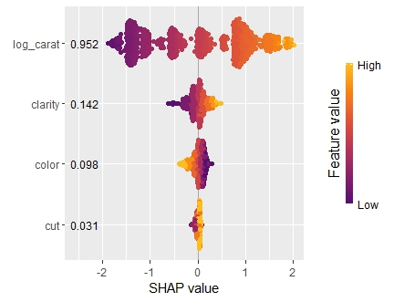

# The "kernelshap" package <a href='https://github.com/mayer79/kernelshap'></a>

## Introduction

SHAP values (Lundberg and Lee, 2017) decompose model predictions into additive contributions of the features in a fair way. A model agnostic approach is called Kernel SHAP, introduced in Lundberg and Lee (2017), and investigated in detail in Covert and Lee (2021). 

The "kernelshap" package implements a multidimensional refinement of the Kernel SHAP Algorithm described in Covert and Lee (2021). The package allows to calculate Kernel SHAP values in an exact way, by iterative sampling (as in Covert and Lee, 2021), or by a hybrid of the two. As soon as sampling is involved, the algorithm iterates until convergence, and standard errors are provided.

The default behaviour depends on the number of features $p$:

- $2 \le p \le 8$: Exact Kernel SHAP values are returned. (Exact regarding the given background data.)
- $p > 8$: Hybrid (partly exact) iterative version of Kernel SHAP. The algorithm iterates until Kernel SHAP values are sufficiently accurate.
- $p = 1$: Exact Shapley values are returned.

The main function `kernelshap()` has three key arguments:

- `object`: Fitted model object.
- `X`: A (n x p) `matrix`, `data.frame`, `tibble` or `data.table` of rows to be explained. Important: The columns should only represent model features, not the response.
- `bg_X`: Background data used to integrate out "switched off" features, 
often a subset of the training data (typically 50 to 500 rows). It should contain the same columns as `X`. In cases with a natural "off" value (like MNIST digits), this can also be a single row with all values set to the off value.

Additional arguments of `kernelshap()` can be used to control details of the algorithm, to activate parallel processing, or to manually pass a prediction function.

**Remarks**

- To visualize the result, you can use R package "shapviz".
- Passing `bg_w` allows to weight background data according to case weights.
- The algorithm tends to run faster if `X` is a matrix or tibble.
- In order to use parallel processing, the backend must be set up beforehand, see the example below.

## Installation

``` r
# install.packages("devtools")
devtools::install_github("mayer79/kernelshap")
```

## Workflow to explain whole model

The typical workflow of a SHAP analysis to explain any model:

1. **Model** `object`: Fit a model `object` on some training data, e.g., a linear regression, an additive model, a random forest or a deep neural net. The only requirement is that predictions are numeric.
2. **Rows to explain** `X`: Sample 500 to 2000 rows to be explained from the training data. `X` should contain only feature columns. If the training dataset is small, simply use the full training data for this purpose. Calculations will be done row by row, so the algorithm scales linearly in the number of rows of `X`.
3. **Background data** `bg_X`: Kernel SHAP requires a representative background data to calculate marginal means. For this purpose, set aside 50 to 500 rows from the training data. `kernelshap()` will need to calculate model predictions on datasets that are typically up to 500 times larger than `bg_X`.

### Example: Linear regression

Let's illustrate this on the famous diamonds data in the "ggplot2" package.

```r
library(tidyverse)
library(kernelshap)
library(shapviz)

# Prepare data
diamonds <- diamonds %>% 
  mutate(
  log_price = log(price), 
  log_carat = log(carat)
)

# Fit model
fit_lm <- lm(log_price ~ log_carat + clarity + color + cut, data = diamonds)

set.seed(10)
xvars <- c("log_carat", "clarity", "color", "cut")
X <- diamonds[sample(nrow(diamonds), 1000), xvars]
bg_X <- diamonds[sample(nrow(diamonds), 200), ]

# Crunch SHAP values for all rows of X
system.time(
  shap_lm <- kernelshap(fit_lm, X, bg_X = bg_X)
)
shap_lm

# SHAP values of first 2 observations:
#           carat    clarity       color         cut
# [1,]  1.2692479  0.1081900 -0.07847065 0.004630899
# [2,] -0.4499226 -0.1111329  0.11832292 0.026503850

# Plot with shapviz
sv_lm <- shapviz(shap_lm)
sv_importance(sv_lm)
sv_dependence(sv_lm, "log_carat")
```


### Example: Random forest

We can use the same `X` and `bg_X` for other models, e.g., a random forest:

```r
library(ranger)

fit_rf <- ranger(
  log_price ~ log_carat + clarity + color + cut, 
  data = diamonds, 
  num.trees = 20,
  seed = 20
)

# An alternative to Kernel SHAP would be TreeSHAP
shap_rf <- kernelshap(fit_rf, X, bg_X = bg_X)

# Plot
sv_rf <- shapviz(shap_rf)
sv_importance(sv_rf, kind = "bee", show_numbers = TRUE)
sv_dependence(sv_rf, "log_carat", color_var = "auto")
```




### Example: Deep neural net

Or a deep neural net (results not fully reproducible):

```r
library(keras)

nn <- keras_model_sequential()
nn %>% 
  layer_dense(units = 30, activation = "relu", input_shape = 4) %>% 
  layer_dense(units = 15, activation = "relu") %>% 
  layer_dense(units = 1)

nn %>% 
  compile(optimizer = optimizer_adam(learning_rate = 0.1), loss = "mse")

# Callbacks
cb <- list(
  callback_early_stopping(patience = 20),
  callback_reduce_lr_on_plateau(patience = 5)
)
       
# Fit model
nn %>% fit(
  x = data.matrix(diamonds[xvars]),
  y = diamonds$log_price,
  epochs = 100,
  batch_size = 400, 
  validation_split = 0.2,
  callbacks = cb
)

shap_nn <- kernelshap(nn, data.matrix(X), bg_X = data.matrix(bg_X), batch_size = 10000)

# Plot
sv_nn <- shapviz(shap_nn, X = X)
sv_importance(sv_nn, show_numbers = TRUE)
sv_dependence(sv_nn, "clarity", color_var = "auto")
```


## tidymodels, caret, mlr3

Meta-learner packages like "tidyvmodels", "caret", and "mlr3" are supported as well.

### Example: tidymodels
```r
library(tidymodels)

dia_recipe <- diamonds %>%
  recipe(log_price ~ log_carat + clarity + color + cut)

reg <- linear_reg() %>%
  set_engine("lm")
  
dia_wf <- workflow() %>%
  add_recipe(dia_recipe) %>%
  add_model(reg)

fit_tidy <- dia_wf %>%
  fit(diamonds)
  
shap_tidy <- kernelshap(fit_tidy, X, bg_X = bg_X)

```

## Parallel computing

As long as you have set up a parallel processing backend, parallel computing is supported via `foreach` and `%dorng`. The latter ensures that `set.seed()` will lead to reproducible results.

### Linear regression continued

```r
library(doFuture)

# Set up parallel backend
registerDoFuture()
plan(multisession, workers = 2)  # Windows
# plan(multicore, workers = 2)   # Linux, macOS, Solaris

# With parallel computing (run twice to see the difference)
system.time(
  s <- kernelshap(fit_lm, X, bg_X = bg_X, parallel = TRUE)
)
```

### Parallel GAM on Windows

On Windows, sometimes not all packages or global objects are passed to the parallel sessions. In this case, the necessary instructions to `foreach` can be specified through a named list via `parallel_args`, see the following example:

```r
library(mgcv)

fit_gam <- gam(Sepal.Length ~ s(Sepal.Width) + Species, data = iris)

shap_gam <- kernelshap(
  fit_gam, 
  X, 
  bg_X = bg_X 
  parallel = TRUE, 
  parallel_args = list(.packages = "mgcv")
  )
)
shap_gam

SHAP values of first 2 observations:
     Sepal.Width   Species
[1,]  0.35570963 -1.135187
[2,] -0.04607082 -1.135187
```

## Exact/sampling/hybrid

In above examples, since $p$ was small, exact Kernel SHAP values were calculated. Here, we want to show how to use the different strategies (exact, hybrid, and pure sampling) in a situation with ten features, see `?kernelshap` for details about those strategies.

With ten features, a degree 2 hybrid is being used by default: 

```r
library(kernelshap)

set.seed(1)
X <- data.frame(matrix(rnorm(1000), ncol = 10))
y <- rnorm(10000L)
fit <- lm(y ~ ., data = cbind(y = y, X))

s <- kernelshap(fit, X[1L, ], bg_X = X)
summary(s)
s$S[1:5]
# Kernel SHAP values by the hybrid strategy of degree 2
#   - SHAP matrix of dim 1 x 10
#   - baseline: -0.005390948
#   - average number of iterations: 2 
#   - rows not converged: 0 
#   - proportion exact: 0.9487952 
#   - m/iter: 20
#   - m_exact: 110
# 0.0101998581  0.0027579289 -0.0002294437  0.0005337086  0.0001179876
```

The algorithm converged in the minimal possible number of two iterations and used $110 + 2\cdot 20 = 150$ on-off vectors $z$. For each $z$, predictions on a data set with the same size as the background data are done. Three calls to `predict()` were necessary (one for the exact part and one per sampling iteration).

Since $p$ is not very large in this case, we can also force the algorithm to use exact calculations:

```r
s <- kernelshap(fit, X[1L, ], bg_X = X, exact = TRUE)
summary(s)
s$S[1:5]
# Exact Kernel SHAP values
#   - SHAP matrix of dim 1 x 10
#   - baseline: -0.005390948
#   - m_exact: 1022
# 0.0101998581  0.0027579289 -0.0002294437  0.0005337086  0.0001179876
```

The results are identical. While more on-off vectors $z$ were required (1022), only a single call to `predict()` was necessary.

Pure sampling (not recommended!) can be enforced by setting the hybrid degree to 0:

```r
s <- kernelshap(fit, X[1L, ], bg_X = X, hybrid_degree = 0)
summary(s)
s$S[1:5]
# Kernel SHAP values by iterative sampling
#   - SHAP matrix of dim 1 x 10
#   - baseline: -0.005390948
#   - average number of iterations: 2 
#   - rows not converged: 0 
#   - proportion exact: 0 
#   - m/iter: 80
#   - m_exact: 0
# 0.0101998581  0.0027579289 -0.0002294437  0.0005337086  0.0001179876
```

The results are again identical here and the algorithm converged in two steps. In this case, two calls to `predict()` were necessary and a total of 160 $z$ vectors were required.

## References

[1] Scott M. Lundberg and Su-In Lee. A Unified Approach to Interpreting Model Predictions. Advances in Neural Information Processing Systems 30, 2017.

[2] Ian Covert and Su-In Lee. Improving KernelSHAP: Practical Shapley Value Estimation Using Linear Regression. Proceedings of The 24th International Conference on Artificial Intelligence and Statistics, PMLR 130:3457-3465, 2021.
