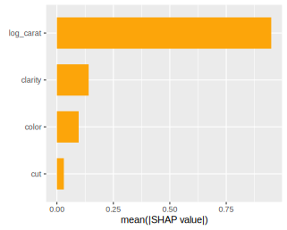

# kernelshap <a href='https://github.com/ModelOriented/kernelshap'></a>

<!-- badges: start -->

[](https://cran.r-project.org/package=kernelshap)
[](https://github.com/ModelOriented/kernelshap/actions)
[](https://app.codecov.io/gh/ModelOriented/kernelshap?branch=main)

[](https://cran.r-project.org/package=kernelshap) 
[](https://cran.r-project.org/package=kernelshap)

<!-- badges: end -->

## Overview

The package contains two workhorses to calculate SHAP values for any model:

- `permshap()`: Exact permutation SHAP algorithm of [1]. Available for up to $p=14$ features.
- `kernelshap()`: Kernel SHAP algorithm of [2] and [3]. By default, exact Kernel SHAP is used for up to $p=8$ features, and an almost exact hybrid algorithm otherwise.

### Kernel SHAP or permutation SHAP?

Kernel SHAP has been introduced in [2] as an approximation of permutation SHAP [1]. For up to ten features, exact calculations are realistic for both algorithms. Since exact Kernel SHAP is still only an approximation of exact permutation SHAP, the latter should be preferred in this case, even if the results are often very similar.

A situation where the two approaches give different results: The model has interactions of order three or higher.

### Typical workflow to explain any model

1. **Sample rows to explain:** Sample 500 to 2000 rows `X` to be explained. If the training dataset is small, simply use the full training data for this purpose. `X` should only contain feature columns.
2. **Select background data:** Both algorithms require a representative background dataset `bg_X` to calculate marginal means. For this purpose, set aside 50 to 500 rows from the training data.
If the training data is small, use the full training data. In cases with a natural "off" value (like MNIST digits), this can also be a single row with all values set to the off value.
3. **Crunch:** Use `kernelshap(object, X, bg_X, ...)` or `permshap(object, X, bg_X, ...)` to calculate SHAP values. Runtime is proportional to `nrow(X)`, while memory consumption scales linearly in `nrow(bg_X)`.
4. **Analyze:** Use {shapviz} to visualize the results.

**Remarks**

- Multivariate predictions are handled at no additional computational cost.
- Factor-valued predictions are automatically turned into one-hot-encoded columns.
- Case weights are supported via the argument `bg_w`.
- By changing the defaults in `kernelshap()`, the iterative pure sampling approach in [3] can be enforced.

## Installation

```r
# From CRAN
install.packages("kernelshap")

# Or the development version:
devtools::install_github("ModelOriented/kernelshap")
```

## Basic Usage

Let's model diamond prices with a (not too complex) random forest. As an alternative, you could use the {treeshap} package in this situation.

```r
library(kernelshap)
library(ggplot2)
library(ranger)
library(shapviz)

diamonds <- transform(
  diamonds,
  log_price = log(price), 
  log_carat = log(carat)
)

xvars <- c("log_carat", "clarity", "color", "cut")

fit <- ranger(
  log_price ~ log_carat + clarity + color + cut, 
  data = diamonds, 
  num.trees = 100,
  seed = 20
)
fit  # OOB R-squared 0.989

# 1) Sample rows to be explained
set.seed(10)
X <- diamonds[sample(nrow(diamonds), 1000), xvars]

# 2) Select background data
bg_X <- diamonds[sample(nrow(diamonds), 200), ]

# 3) Crunch SHAP values for all 1000 rows of X (54 seconds)
# Note: Since the number of features is small, we use permshap()
system.time(
  ps <- permshap(fit, X, bg_X = bg_X)
)
ps

# SHAP values of first observations:
      log_carat     clarity       color         cut
[1,]  1.1913247  0.09005467 -0.13430720 0.000682593
[2,] -0.4931989 -0.11724773  0.09868921 0.028563613

# Kernel SHAP gives almost the same:
system.time(  # 49 s
  ks <- kernelshap(fit, X, bg_X = bg_X)
)
ks
#       log_carat     clarity       color        cut
# [1,]  1.1911791  0.0900462 -0.13531648 0.001845958
# [2,] -0.4927482 -0.1168517  0.09815062 0.028255442

# 4) Analyze with our sister package {shapviz}
ps <- shapviz(ps)
sv_importance(ps)
sv_dependence(ps, xvars)
```




## More Examples

{kernelshap} can deal with almost any situation. We will show some of the flexibility here. The first two examples require you to run at least up to Step 2 of the "Basic Usage" code.

### Parallel computing

Parallel computing is supported via {foreach}. Note that this does not work with all models, and that there is no progress bar. 

On Windows, sometimes not all packages or global objects are passed to the parallel sessions. Often, this can be fixed via `parallel_args`, see the generalized additive model below. 

```r
library(doFuture)
library(mgcv)

registerDoFuture()
plan(multisession, workers = 4)  # Windows
# plan(multicore, workers = 4)   # Linux, macOS, Solaris

fit <- gam(log_price ~ s(log_carat) + clarity * color + cut, data = diamonds)

system.time(  # 9 seconds in parallel
  ps <- permshap(
    fit, X, bg_X = bg_X, parallel = TRUE, parallel_args = list(.packages = "mgcv")
  )
)
ps

# SHAP values of first observations:
#      log_carat    clarity       color         cut
# [1,]   1.26801  0.1023518 -0.09223291 0.004512402
# [2,]  -0.51546 -0.1174766  0.11122775 0.030243973

# Because there are no interactions of order above 2, Kernel SHAP gives the same:
system.time(  # 27 s non-parallel
  ks <- kernelshap(fit, X, bg_X = bg_X)
)
all.equal(ps$S, ks$S)
# [1] TRUE

# Now the usual plots:
sv <- shapviz(ps)
sv_importance(sv, kind = "bee")
sv_dependence(sv, xvars)
```


### Taylored predict()

In this {keras} example, we show how to use a tailored `predict()` function that complies with 

- the Keras API, 
- uses sufficiently large batches, and 
- turns off the Keras progress bar.

The results are not fully reproducible though.

```r
library(keras)

nn <- keras_model_sequential()
nn |>
  layer_dense(units = 30, activation = "relu", input_shape = 4) |>
  layer_dense(units = 15, activation = "relu") |>
  layer_dense(units = 1)

nn |>
  compile(optimizer = optimizer_adam(0.001), loss = "mse")

cb <- list(
  callback_early_stopping(patience = 20),
  callback_reduce_lr_on_plateau(patience = 5)
)
       
nn |>
  fit(
    x = data.matrix(diamonds[xvars]),
    y = diamonds$log_price,
    epochs = 100,
    batch_size = 400, 
    validation_split = 0.2,
    callbacks = cb
  )

pred_fun <- function(mod, X) 
  predict(mod, data.matrix(X), batch_size = 1e4, verbose = FALSE)

system.time(  # 60 s
  ps <- permshap(nn, X, bg_X = bg_X, pred_fun = pred_fun)
)

ps <- shapviz(ps)
sv_importance(ps, show_numbers = TRUE)
sv_dependence(ps, xvars)
```


### Multi-output models

{kernelshap} supports multivariate predictions like:

- probabilistic classification,
- non-probabilistic classification (factor-valued responses are turned into dummies),
- regression with multivariate response, and
- predictions found by applying multiple regression models.

Here, we use the `iris` data (no need to run code from above).

```r
library(kernelshap)
library(ranger)
library(shapviz)

set.seed(1)

# Probabilistic classification
fit_prob <- ranger(Species ~ ., data = iris, probability = TRUE)
ps_prob <- permshap(fit_prob, X = iris[, -5], bg_X = iris) |> 
  shapviz()
sv_importance(ps_prob)
sv_dependence(ps_prob, "Petal.Length")

# Non-probabilistic classification (results not shown)
fit_class <- ranger(Species ~ ., data = iris, num.trees = 20)
ps_class <- permshap(fit_class, X = iris[, -5], bg_X = iris)
```


### Tidymodels

Meta-learning packages like {tidymodels}, {caret} or {mlr3} are straight-forward to use. The following example additionally shows that the `...` argument of `permshap()` and `kernelshap()` is passed to `predict()`.

```r
library(kernelshap)
library(tidymodels)

set.seed(1)

iris_recipe <- iris |> 
  recipe(Species ~ .)

mod <- rand_forest(trees = 100) |>
  set_engine("ranger") |> 
  set_mode("classification")
  
iris_wf <- workflow() |>
  add_recipe(iris_recipe) |>
  add_model(mod)

fit <- iris_wf |>
  fit(iris)

system.time(  # 6s
  ps <- permshap(fit, iris[-5], bg_X = iris, type = "prob")
)
ps

# Some values
$.pred_setosa
     Sepal.Length Sepal.Width Petal.Length Petal.Width
[1,]   0.02186111 0.012137778    0.3658278   0.2667667
[2,]   0.02628333 0.001315556    0.3683833   0.2706111
```

## References

[1] Erik Štrumbelj and Igor Kononenko. Explaining prediction models and individual predictions with feature contributions. Knowledge and Information Systems 41, 2014.

[2] Scott M. Lundberg and Su-In Lee. A Unified Approach to Interpreting Model Predictions. Advances in Neural Information Processing Systems 30, 2017.

[3] Ian Covert and Su-In Lee. Improving KernelSHAP: Practical Shapley Value Estimation Using Linear Regression. Proceedings of The 24th International Conference on Artificial Intelligence and Statistics, PMLR 130:3457-3465, 2021.
